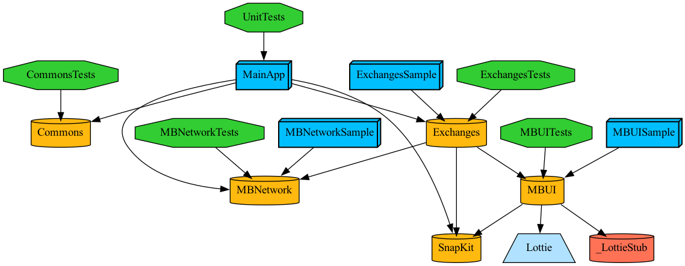

# Mercado Bitcoin Challenge

*Made by: **Kaique Magno***

*To: **Senior iOS Developer Role***

## Instructions
**Run the command `make all`**

## Class Graph 

## DONE
- Create project with TUIST to use modular archtecture, so the app can grow exponentially 
- Add SnapKit to facilitate ViewCoding
- Create Exchange List presenting all asked info of Exchanges
- Prepare the list to load image without using third party libreries
- Prevent to loading image incorrectly at cell
- App work in both light ☀️ and dark 🌑 appereance
- Set UINavigationAppearence
- Loading State using Lottie
- Error State
- Empty State
- Add some Unit Tests
- Set the bundle configuration
- Add command to configure Makefile

## TODO
### Project Environemnt
- Add more Unit Tests 
- Configurate and Add UITests
- Create scripts to facilitate the creation of new Features and Tools
- Add the Feature and Tools scripts into Makefile
- Prepare CI commands
